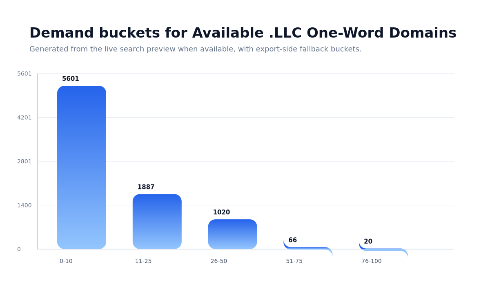

# Available .LLC One-Word Domains (5,622,441)

<p align="left">
  
  
  
  
  
  
</p>

Daily-updated public extract of available and resale .llc one-word domains from Unique Domains.

> **Important:** this repository is a **public 8,595-row extract**, not the full live catalog.
> The full live catalog for this exact search currently contains **5,622,441 domains** on the canonical page below.

**Last updated:** 2026-04-09  
**Canonical page:** `https://unique.domains/domains/tld/llc`  
**Best for:** founders, investors, studios

---

<p align="center">
  <a href="https://unique.domains/domains/tld/llc?utm_source=github&utm_medium=referral&utm_campaign=repo_llc_oneword_domains&utm_content=top_open_search"><b>Open live .LLC search</b></a> ·
  <a href="https://unique.domains/domains/tld/llc?github_intent=radar&utm_source=github&utm_medium=referral&utm_campaign=repo_llc_oneword_domains&utm_content=top_create_radar"><b>Create .LLC Radar</b></a> ·
  <a href="https://unique.domains/domains/tld/llc?github_intent=project&utm_source=github&utm_medium=referral&utm_campaign=repo_llc_oneword_domains&utm_content=top_start_project"><b>Start a naming Project</b></a> ·
  <a href="./llc.csv"><b>Download CSV</b></a> ·
  <a href="./llc.json"><b>Download JSON</b></a> ·
  <a href="https://unique.domains/technology?utm_source=github&utm_medium=referral&utm_campaign=repo_llc_oneword_domains&utm_content=top_methodology"><b>Methodology</b></a> ·
  <a href="https://unique.domains/api?utm_source=github&utm_medium=referral&utm_campaign=repo_llc_oneword_domains&utm_content=top_api_docs"><b>API docs</b></a>
</p>

## 📦 What this repository contains

This repository is the public extract for Unique Domains' .LLC one-word domain catalog.

### Files

- `llc.csv` — public CSV extract (8,595 rows)
- `llc.json` — public JSON extract (8,595 rows)
- `DATA_DICTIONARY.md` — field definitions for the exported files
- `METHODOLOGY.md` — scope, refresh policy, and caveats
- `CHANGELOG.md` — latest snapshot metadata
- `CITATION.cff` — machine-readable dataset citation metadata
- `LICENSE` — terms for the public extract
- `assets/chart-demand-buckets.png` — generated demand-buckets chart

### Use this repo to

- inspect a public sample
- download CSV or JSON
- cite the dataset
- understand the fields and scoring inputs

### Use the live page to

- keep the exact search context
- search the full .LLC catalog
- filter by price, demand, status, spelling risk, and fit
- save the exact search as a Radar
- turn the search into a founder Project

## 📊 Snapshot of the live .LLC catalog



**Why this chart:** it gives a fast overview of the live search composition using the same preview payload that supplies the README counts.

## 🧭 Quick start

```python
import pandas as pd

df = pd.read_csv("https://raw.githubusercontent.com/UniqueDomains/llc-oneword-domains/main/llc.csv")
print(df.head())
```

## 🗂️ Sample rows

| domain       | status    | purchase_price | renewal_price | attractiveness | demand | length | registrar         |
| ------------ | --------- | -------------- | ------------- | -------------- | ------ | ------ | ----------------- |
| gather.llc   | available | $19.99         | $54.99        | 96             | 39     | 6      | name.com          |
| cure.llc     | resell    | $19.99         | $54.99        | 72             | 26     | 4      | GoDaddy.com, LLC  |
| power.llc    | premium   | $1,300         | $1,300        | 98             | 64     | 5      | namecheap         |
| hidden.llc   | available | $19.99         | $54.99        | 65             | 35     | 6      | name.com          |
| discover.llc | resell    | —              | —             | 66             | 75     | 8      | Sav.com, LLC      |
| cloud.llc    | premium   | $650           | $650          | 70             | 59     | 5      | namecheap         |
| chill.llc    | available | $19.99         | $54.99        | 72             | 33     | 5      | name.com          |
| hello.llc    | resell    | —              | —             | 92             | 71     | 5      | Spaceship, Inc.   |
| ace.llc      | premium   | $625           | $625          | 88             | 57     | 3      | name.com          |
| ethereal.llc | available | $19.99         | $54.99        | 88             | 32     | 8      | name.com          |
| get.llc      | resell    | —              | —             | 88             | 69     | 3      | Sav.com, LLC - 41 |
| good.llc     | premium   | $625           | $625          | 82             | 55     | 4      | name.com          |
| mass.llc     | available | $19.99         | $54.99        | 78             | 30     | 4      | name.com          |
| stellar.llc  | resell    | —              | —             | 78             | 50     | 7      | Porkbun LLC       |
| business.llc | premium   | $3,250         | $3,250        | 100            | 54     | 8      | namecheap         |
| wicked.llc   | available | $19.99         | $54.99        | 70             | 30     | 6      | name.com          |
| momentum.llc | resell    | —              | —             | 74             | 45     | 8      | GoDaddy.com, LLC  |
| true.llc     | premium   | $2,500         | $2,500        | 86             | 52     | 4      | name.com          |
| cipher.llc   | available | $19.99         | $44.99        | 86             | 29     | 6      | name.com          |
| drone.llc    | resell    | —              | —             | 70             | 45     | 5      | Sav.com, LLC - 45 |

## 🧱 Field summary

- `domain` — Fully qualified domain name.
- `status` — Current acquisition state for the domain in the public extract.
- `purchase_price` — Visible purchase price when available.
- `renewal_price` — Visible renewal price when available.
- `attractiveness` — Composite naming score used as a decision-support signal.
- `demand` — Relative buyer-pressure score when available.
- `length` — Character count without the TLD.
- `registrar` — Registrar name when known.
- `created_at` — Creation timestamp when known.
- `expires_at` — Expiry timestamp when known.

See [DATA_DICTIONARY.md](./DATA_DICTIONARY.md) for full definitions and types.

## ⚠️ Methodology and caveats

This repository follows the exact public search represented by the canonical page above.

- This repository is a public extract, not the full live catalog.
- Counts, prices, and statuses can change over time.
- Scores are decision-support signals, not guarantees of resale value.
- Trademark, SEO, and risk signals should be treated as screening inputs, not legal or specialist advice.
- The live product contains deeper filters, monitoring, and decision workflows than this public extract.

See [METHODOLOGY.md](./METHODOLOGY.md) for the full methodology reference.

## 🔄 Update policy

- This repository is refreshed regularly from the same export pipeline used for public dataset repos.
- The README count targets the live catalog count from the public landing response when available.
- The CSV and JSON files contain the public extract only and may not match the full live catalog size.
- Stable historical references should be published via GitHub Releases outside this repository snapshot.

See [CHANGELOG.md](./CHANGELOG.md) for the latest snapshot metadata.

## 📝 How to cite

Suggested citation:

> Unique Domains. *Available .LLC One-Word Domains*. Version 2026-04-09. Public GitHub extract for the exact Unique Domains search represented by this repository.

GitHub citation metadata is available in [CITATION.cff](./CITATION.cff).


## 🔗 Related links

- [Live .LLC page](https://unique.domains/domains/tld/llc?utm_source=github&utm_medium=referral&utm_campaign=repo_llc_oneword_domains&utm_content=top_open_search)
- [Technology and scoring](https://unique.domains/technology?utm_source=github&utm_medium=referral&utm_campaign=repo_llc_oneword_domains&utm_content=top_methodology)
- [Pricing](https://unique.domains/pricing?utm_source=github&utm_medium=referral&utm_campaign=repo_llc_oneword_domains&utm_content=related_pricing)
- [Main catalog repo](https://github.com/UniqueDomains/oneword-domains)

## 📬 Contact

Questions, corrections, or partnership requests: `hello@unique.domains`
